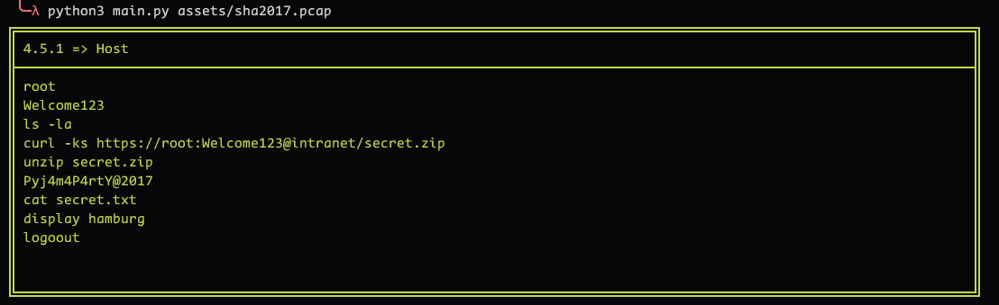

# USB Keyboard Parser

**USB Keyboard Parser** The USB Keyboard Parser is an automated tool designed to extract and decode Human Interface Device (HID) data from pcap files. It works with two types of USB link types:

- `LinkTypeUsbLinuxMmapped`: Captured USB traffic from Linux systems using memory-mapped I/O.

- `LinkTypeUsbPcap`: Standard USB link type used in regular pcap files for capturing USB traffic.

**Features** 

Two scripts are currently available:

- `main.py`: Displays output based on Device Id, providing accurate results compared to `Usb_Keyboard_Parser.py`. It directly parses USB structures without relying on external dependencies and supports both pcap and pcapng formats.

- `Usb_Keyboard_Parser.py`: Relies on `tshark` to extract the HID payload from packet captures and then decodes the data.

    
#### TODO

- [ ] Add support for Darwin USB link types.

#### Bugs 

- Feel free to create issues.

# Usage :

**New Script**

```bash
  python3 main.py <pcap-file/pcapng-file>
```



**Old Script**

```bash
  python3 Usb_Keyboard_Parser.py <pcap-file/pcapng-file>
```


